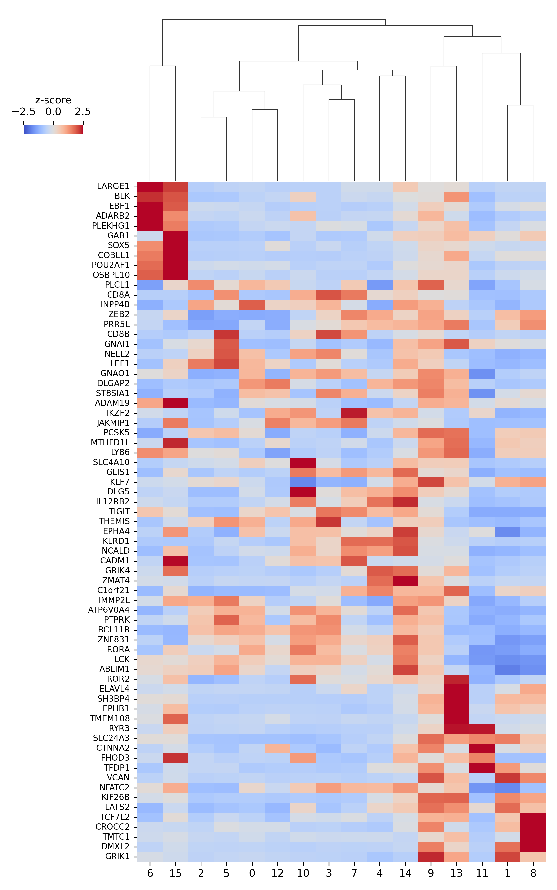
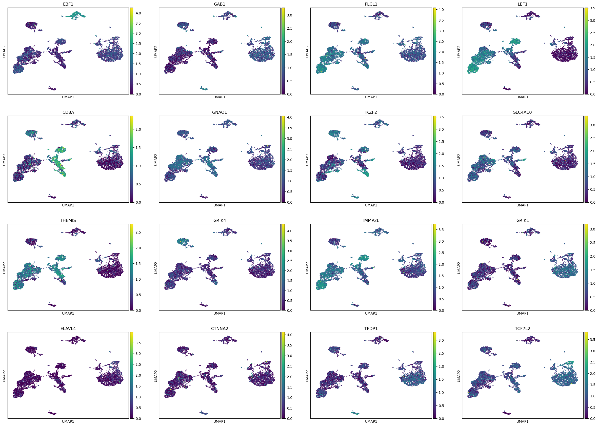

# scATAC-Seq Analysis Using a Poisson Model

- The motivation for this analysis was inspired by [this publication](https://www.nature.com/articles/s41592-023-02112-6) wherein it was observed that poisson models can be used with quantitative fragment counts to enhance the interpretability of scATAC-Seq data.

- While there is already a [tool](https://docs.scvi-tools.org/en/stable/tutorials/notebooks/atac/PoissonVI.html) that exists within the scvi-tools suite to analyze such data, it is computationally expensive and inaccessible to researchers with lower-end computational power.

- Here, I am showcasing how orthogonal methods can be used to achieve similar results with standard single-cell tools that exist the scverse.

## Preprocessing

Publicly available data was first obtained from the 10X Genomics wesbsite:

- [Raw data](https://cf.10xgenomics.com/samples/cell-atac/2.1.0/10k_pbmc_ATACv2_nextgem_Chromium_Controller/10k_pbmc_ATACv2_nextgem_Chromium_Controller_filtered_peak_bc_matrix.h5)

- [Fragments file](https://cf.10xgenomics.com/samples/cell-atac/2.1.0/10k_pbmc_ATACv2_nextgem_Chromium_Controller/10k_pbmc_ATACv2_nextgem_Chromium_Controller_fragments.tsv.gz)

- [Fragments index](https://cf.10xgenomics.com/samples/cell-atac/2.1.0/10k_pbmc_ATACv2_nextgem_Chromium_Controller/10k_pbmc_ATACv2_nextgem_Chromium_Controller_fragments.tsv.gz.tbi)

We will also need an peak_annotation.tsv file as outlined [here](https://www.10xgenomics.com/support/software/cell-ranger-atac/latest/analysis/peak-annotations).

In the misc_scripts folder, there is home-brew command line tool that can generate this file by taking in two fiiles:

1. gtf file containing transcriptomic coordinates
2. filtered .h5 matrix output from cellRanger

Below is an example of its usage from the command line:

<pre> python ~/misc_scripts/map_peaks_to_genes.py \
  --input_file atac_v2_pbmc_10k_filtered_peak_bc_matrix.h5 \ 
  --gtf_file ~/refdata-gex-GRCh38-2020-A/genes/genes.gtf </pre>

The next portion of the preprocessing takes into account the following:

1. Removing undetected peaks
2. Filtering peaks deteced in less than ~30 cells
3. Calculating transcription start-site (TSS) enrichment
4. Enriching for nucleosome-free fragments by calculating the nucleosomal signal based on fragment length

## Normalisation

We will follow a similar logic to quantitivaly analyze the data using a poisson model as outlined in [this publication](https://www.nature.com/articles/s41592-023-02112-6).

First, we use a home-brew function in the /misc_scripts/helper_funcs.py file that creates a fragment matrix.

From there, the fragment matrix is used to calculate pearson residuals against a poisson model for feature selection.

Highly variable features are selected and used for subsequent dimensionality reduction.

We then finish up with create a gene activty matrix to relate the fragment counts signal to relevant genes of interest that can be used for further integration and label transfer with scRNA-Seq data

## Generating a gene activity matrix and finding biologically relevant peaks

We use our normalized matrix of peaks to do the following:

1. Leverage the term frequency-inverse document frequency (tf-idf) method to perform dimensionality reduction on atac-seq data
2. Generate a gene activity matrix to find open chromatin peaks around genes
3. Use the gene activity matrix to reduce the number of features, survey various feature selection methods, and perform a logistic regression to find differentially accessible gene-relevent peaks

### Differentially accessible peaks

